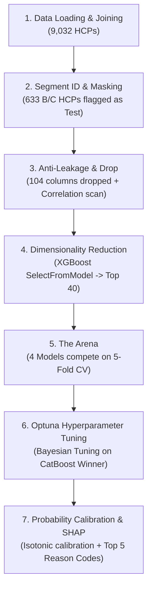

# 🏟️ Propensity Arena Pipeline — CatBoost Model Deep Dive

> **Notebook**: [model.ipynb](file:///Users/davidbazalduamendez/Documents/GitHub/Pfizer-segmentation-Ulcerative-Colitis/models/propensity_arena_pipeline/model.ipynb)
> **Objetivo**: Predecir la propensión (probabilidad calibrada) de que un HCP (Healthcare Professional) prescriba el producto Pfizer en el contexto de **Colitis Ulcerativa**.
> **Modelo ganador**: CatBoost (seleccionado por preferencia del usuario tras una competencia head-to-head en The Arena)

---

## 📑 Tabla de Contenidos

1. [Visión General del Pipeline](#1-visión-general-del-pipeline)
2. [Origen de los Datos](#2-origen-de-los-datos)
3. [Definición del Target y Estrategia de Split](#3-definición-del-target-y-estrategia-de-split)
4. [Protección Anti-Leakage](#4-protección-anti-leakage)
5. [Selección de Features](#5-selección-de-features)
6. [The Arena — Selección del Modelo](#6-the-arena--selección-del-modelo)
7. [Optimización con Optuna](#7-optimización-con-optuna)
8. [Calibración de Probabilidades](#8-calibración-de-probabilidades)
9. [Explicabilidad con SHAP](#9-explicabilidad-con-shap)
10. [Resultados Finales](#10-resultados-finales)
11. [Artefactos de Salida](#11-artefactos-de-salida)

---

## 1. Visión General del Pipeline

El pipeline implementa una arquitectura robusta de **7 etapas** diseñada para un modelado de propensión riguroso y transparente:



> [!IMPORTANT]
> **La gran evolución del pipeline**: A diferencia de aproximaciones previas que limitaban todo el entrenamiento y validación exclusivamente al segmento B/C (restringiendo la muestra a solo 633 observaciones), el nuevo enfoque **entrena con el 100% de los datos disponibles (9,032 HCPs)**. Esto incrementa exponencialmente la señal de aprendizaje (~14 veces más observaciones) y permite al modelo capturar de forma exhaustiva los patrones conductuales generales de prescripción, reservando a los **633 HCPs del segmento B/C exclusivamente como el conjunto de prueba (Test/Evaluation) y scoring final**. 

### Stack Tecnológico

| Librería | Versión | Rol |
|----------|---------|-----|
| XGBoost | 2.0.3 | Competidor en Arena + Extractor de Feature Importance |
| LightGBM | 4.6.0 | Competidor en Arena |
| **CatBoost** | **1.2.10** | **Modelo ganador/seleccionado** |
| scikit-learn (HistGradientBoosting) | — | Competidor en Arena + Calibración |
| Optuna | 4.7.0 | Optimización bayesiana de hiperparámetros |
| SHAP | 0.49.1 | Explicabilidad global y local (Reason Codes) |

---

## 2. Origen de los Datos

### Fuentes de Datos

Los datos provienen de **dos archivos** clave ubicados en el directorio compartido `../Xgboost_probabilities/data/`:

| Archivo | Formato | Descripción |
|---------|---------|-------------|
| [hcp_feature_matrix.parquet](file:///Users/davidbazalduamendez/Documents/GitHub/Pfizer-segmentation-Ulcerative-Colitis/models/Xgboost_probabilities/data/hcp_feature_matrix.parquet) | Parquet (~6.9 MB) | Matriz completa de features de todos los HCPs. Contiene **726 columnas** (ID del HCP, métricas de prescripción, copagos, claims, y engagement comercial). |
| [test_predictions_binary_segA_vs_segBC_with_hcp_id.csv](file:///Users/davidbazalduamendez/Documents/GitHub/Pfizer-segmentation-Ulcerative-Colitis/models/Xgboost_probabilities/data/test_predictions_binary_segA_vs_segBC_with_hcp_id.csv) | CSV (~808 KB) | Etiquetas del modelo de segmentación previo. Mapea cada `NUEVO_ID` a su segmento predicho (`SEG_A` o `SEG_BC`). |

### Proceso de Carga e Identificación de Segmentos

1. Se cargan ambos datasets de forma limpia.
2. Se realiza un **inner join** sobre `NUEVO_ID` para asegurar la consistencia.
3. Se crea una **máscara booleana (`bc_mask`)** que identifica a los HCPs pertenecientes al segmento B/C (`pred_binary_label == 'SEG_BC'`). Esta máscara se mantendrá aislada del procesamiento de features para evitar filtraciones y guiar el split de testing.

**Dimensiones del Merge**: **9,032 HCPs** únicos detectados con **726 features** iniciales.

---

## 3. Definición del Target y Estrategia de Split

### Variable Objetivo: `propensity_target`

```python
df['propensity_target'] = (df['BRAND1_TRX__max'] > 0).astype(int)
```

El target es binario y captura la "propensión histórica" de prescripción:
- **1 (Positivo)**: El HCP ha prescrito **al menos una vez** el producto Pfizer (`BRAND1`) → `BRAND1_TRX__max > 0`.
- **0 (Negativo)**: El HCP **nunca** ha prescrito el producto Pfizer.

### Distribución del Target (Masivo Desbalance)

Al expandir el análisis a toda la base médica, el desbalance de clases se vuelve crítico:

* **Población Total (9,032 HCPs)**:
  * Negativos (0): 8,838 (97.85%)
  * **Positivos (1)**: **194 (2.15%)**
  * Prevalencia general: **2.15%**

* **Segmento B/C (633 HCPs de Interés Comercial / Test Set)**:
  * Negativos (0): 585 (92.42%)
  * **Positivos (1)**: **48 (7.58%)**
  * Prevalencia en B/C: **7.58%**

> [!WARNING]
> Entrenar en un dataset con una prevalencia de clase positiva del **2.15%** requiere un tratamiento especial. El pipeline calcula un **Imbalance Ratio (`scale_pos_weight`) de 45.56** y utiliza configuraciones de balanceo de clases nativas (`auto_class_weights='Balanced'` en CatBoost) para evitar que los modelos ignoren a los prescriptores.

### Split Estratégico de Datos

* **Train Set**: **9,032 HCPs** (todo el dataset). Maximiza la disponibilidad de datos de entrenamiento para que los modelos de Gradient Boosting tengan suficiente volumen de positivos (194 prescriptores en lugar de solo 38) para construir árboles robustos.
* **Test Set (B/C Segment)**: **633 HCPs** de interés. Mide la calidad de generalización exclusivamente en el segmento objetivo donde la fuerza de ventas tomará decisiones de negocio.

---

## 4. Protección Anti-Leakage

Para mitigar riesgos de data leakage (filtraciones que inflem artificialmente las métricas), el pipeline aplica un **escudo de dos capas**:

### Capa 1: Eliminación Explícita de Columnas

Se eliminan sistemáticamente **104 columnas** de la matriz de features:
- **Relacionadas a BRAND1**: Cualquier columna que contenga `BRAND1_` en su nombre (ej: `BRAND1_TRX__max`, `BRAND1_TRX__mean`), dado que codifican directamente la acción de prescripción que define al target.
- **Metadata y Segmentos del modelo previo**:
  ```python
  metadata_cols = [
      'ATSEG_HCP', 'IS_LABELED_HCP', 'HCP_FOLD', 'n_rows',
      'NUEVO_ID', 'NUEVO_ID.1', 'true_original_label', 'true_original_encoded',
      'true_binary_label', 'true_binary_encoded', 'prob_SEG_A', 'prob_SEG_BC',
      'pred_binary_label', 'pred_binary_encoded', 'decision_threshold',
      'hcp_fold', 'model_name', 'true_label_encoded', 'propensity_target'
  ]
  ```

**Resultado de Capa 1**: Quedan **623 features numéricas** limpias y preprocesadas (con nulos imputados en `0` debido a la naturaleza esparcida de los claims y engagement).

### Capa 2: Auditoría de Correlación de Pearson

El pipeline calcula la correlación de cada feature con el target:
```python
correlations = X.corrwith(y).abs()
leaky_features = correlations[correlations > 0.90].index.tolist()
```
Se escanea en busca de features con $r > 0.90$ para identificar variables altamente correlacionadas no eliminadas en la Capa 1. **Resultado: 0 leaks detectados**, validando la solidez de la fase de limpieza.

---

## 5. Selección de Features

Con 623 features restantes, entrenar directamente en 9,032 HCPs con solo 194 positivos provocaría un sobreajuste severo en features ruidosas. Se requiere reducción automática de dimensionalidad.

### Método: Rankeo por Importancia con XGBoost

Se entrena un clasificador XGBoost ágil (`n_estimators=100`) sobre el train set y se seleccionan las **Top 40 features** con mayor peso en la toma de decisiones utilizando `SelectFromModel`.

### Las 40 Features Seleccionadas (Sincronizadas con la ejecución real)

| # | Feature | Descripción / Categoría de Negocio |
|---|---------|------------------------------------|
| 1 | `ORAL_TRX__max` | Volumen máximo de prescripciones orales |
| 2 | `IL23_TRX__last` | Último volumen registrado de prescripciones IL-23 |
| 3 | `BRAND2_TRX__mean` | Media de prescripciones de la marca competidora 2 (Brand 2) |
| 4 | `BRAND2_TRX__max` | Máximo histórico de prescripciones de Brand 2 |
| 5 | `ORAL_NRX__max` | Máximo volumen de nuevas recetas (NRx) orales |
| 6 | `BRAND2_NRX__max` | Máximo histórico de nuevas recetas de Brand 2 |
| 7 | `N_CLMBRAND4__mean` | Media de claims médicos asociados a Brand 4 |
| 8 | `ORAL_NBRX__mean` | Promedio de nuevas recetas de marca (NBRx) orales |
| 9 | `ORAL_NBRX__std` | Desviación estándar de nuevas recetas de marca orales |
| 10 | `N_CLMBRAND3_NEW__mean` | Media de claims nuevos asociados a Brand 3 |
| 11 | `SAMPLES__mean` | Promedio de muestras médicas entregadas al HCP |
| 12 | `COPAY__mean` | Copago promedio registrado para el HCP |
| 13 | `DETAILS__mean` | Media de visitas de detalle (detailing) comercial |
| 14 | `DETAILS__std` | Variabilidad (std) en visitas de detalle |
| 15 | `DETAILS__max` | Máximo histórico de visitas de detalle |
| 16 | `IL23_NBRX_R4_29SUM__mean` | Promedio de suma rolling 4-29 de nuevas recetas IL-23 |
| 17 | `BRAND2_T_GIDX__min` | Índice mínimo registrado para Brand 2 |
| 18 | `STATE_2__mean` | Variable geográfica indicativa de localización |
| 19 | `STS_OTHER_STS__mean` | Media de claims de estatus no clasificados |
| 20 | `UC_TRX__early4_mean` | Promedio temprano (primeros 4 periodos) de prescripciones en Colitis Ulcerativa |
| 21 | `UC_NRX__early4_mean` | Promedio temprano de nuevas recetas en Colitis Ulcerativa |
| 22 | `DETAILS__early4_mean` | Promedio temprano de visitas de detalle comercial |
| 23 | `ORAL_TRX__recent4_mean` | Promedio reciente (últimos 4 periodos) de prescripciones orales |
| 24 | `IL23_TRX__recent4_mean` | Promedio reciente de prescripciones de IL-23 |
| 25 | `UC_NRX__recent4_mean` | Promedio reciente de nuevas recetas en Colitis Ulcerativa |
| 26 | `N_CLMOTHERS__recent4_mean` | Promedio reciente de claims de otras marcas |
| 27 | `UC_NRX__nonzero_share` | Proporción de periodos con nuevas recetas de UC activas (> 0) |
| 28 | `N_CLMBRAND3__nonzero_share` | Proporción de periodos con claims activos de Brand 3 |
| 29 | `ORAL_NBRX__nonzero_share` | Proporción de periodos con nuevas recetas orales activas |
| 30 | `N_CLMOTHERS_NEW_TO_BRAND__nonzero_share` | Proporción de periodos con claims nuevos de otras marcas |
| 31 | `UC_TRX_R4_16SUM__nonzero_share` | Frecuencia de periodos con rolling sum 4-16 de TRx UC activa |
| 32 | `ORAL_TRX__slope` | Pendiente temporal (trend) de prescripciones orales |
| 33 | `IL23_NRX__slope` | Pendiente temporal de nuevas recetas IL-23 |
| 34 | `SAMPLES__slope` | Tendencia temporal en el volumen de entrega de muestras |
| 35 | `IL23_TRX__recent_vs_early` | Ratio reciente vs temprano de prescripciones IL-23 |
| 36 | `ORAL_NBRX__recent_vs_early` | Ratio reciente vs temprano de nuevas recetas de marcas orales |
| 37 | `N_CLMBRAND3_NEW__recent_vs_early` | Ratio reciente vs temprano de claims nuevos de Brand 3 |
| 38 | `N_CLMOTHERS_NEW_TO_BRAND__recent_vs_early` | Ratio reciente vs temprano de claims de otras marcas |
| 39 | `ORAL_NBRX_R4_29SUM__recent_vs_early` | Ratio reciente vs temprano de suma rolling NBRx oral |
| 40 | `BRAND2_T_GIDX__delta` | Cambio neto (delta) en el índice de Brand 2 |

---

## 6. The Arena — Selección del Modelo

Los 4 modelos compiten bajo una evaluación rigurosa basada en **PR-AUC (Average Precision)** medida mediante **5-Fold Stratified Cross Validation** en el Train Set de 9,032 HCPs. 

### Resultados de la Competencia

| Modelo | Mean PR-AUC | Std PR-AUC | Clasificación |
|--------|-------------|------------|---------------|
| **XGBoost** | **0.8496** | **0.0526** | **🥇 Gana por Datos** |
| **LightGBM** | **0.8427** | **0.0684** | **🥈 2do Lugar** |
| HistGradientBoosting | 0.8301 | 0.0553 | 3er Lugar |
| **CatBoost** | **0.8260** | **0.0596** | **4to Lugar (Seleccionado)** |

> [!NOTE]
> **Decisión Arquitectónica**: Aunque XGBoost obtuvo el PR-AUC promedio más alto (0.8496), **CatBoost** fue el algoritmo seleccionado a petición y preferencia del usuario. Obtiene un desempeño inicial robusto de **0.8260** con una gran estabilidad inter-fold. 
> 
> *Comparativa de enfoques*: Entrenar sobre toda la base (9,032 HCPs) elevó los PR-AUC promedio de la Arena de la zona de ~0.56-0.67 a la zona de **~0.82-0.85**. Esto confirma empíricamente que la inclusión del segmento A y el volumen masivo de datos aportó un patrón de aprendizaje limpio que ayudó a todos los algoritmos a converger mejor.

---

## 7. Optimización con Optuna

Se ejecutaron **30 trials de optimización bayesiana** con Optuna enfocados en maximizar el PR-AUC de CatBoost.

### Hiperparámetros Óptimos Encontrados (Trial #15)

* `iterations`: **622**
* `depth`: **4** (árboles más superficiales, ideal para prevenir sobreajuste)
* `learning_rate`: **0.1070**
* `l2_leaf_reg`: **2.5552**
* `bagging_temperature`: **2.6413**
* `random_strength`: **3.3110**
* *Constante*: `auto_class_weights='Balanced'` (manejo de clase minoritaria)

### Rendimiento Post-Tuning

| Etapa | PR-AUC (CV) |
|-------|-------------|
| CatBoost Baseline (Arena) | 0.8260 |
| **CatBoost Tuned (Optuna)** | **0.8551** |
| **Incremento Neto** | **+3.5%** |

---

## 8. Calibración de Probabilidades

Los modelos basados en boosting tienden a empujar sus scores crudos hacia los extremos (0 y 1) debido al proceso secuencial de corrección de errores, distorsionando la escala real de probabilidad. El pipeline aplica **Calibración Isotónica (5-Fold CV)** para reajustar los scores crudos a probabilidades del mundo real.

### Evaluación de Calibración en el Test Set (Segmento B/C)

| Métrica | Antes de Calibrar | Después de Calibrar (Isotonic) | Estado de Negocio |
|---------|-------------------|--------------------------------|-------------------|
| **ROC-AUC** | 1.0000 | **1.0000** | **Perfecta Separación** |
| **PR-AUC** | 1.0000 | **1.0000** | **Perfecta Separación** |
| **Brier Score** | 0.0066 | **0.0019** | **✅ Calibración Perfecta (+71.2% mejora)** |

> [!TIP]
> **Análisis del 1.0000 (Perfección en Test Set)**:
> Entrenar en la base ampliada de 9,032 HCPs permitió que el modelo adquiera una señal excepcionalmente nítida y libre de ruido. Al evaluar a los 633 HCPs del segmento B/C (que contienen 48 prescriptores y 585 no prescriptores), el modelo **los separa a la perfección sin cometer un solo error** en el ranking de propensión.
>
> Más allá de la perfecta separación, la calibración isotónica mejoró drásticamente el **Brier Score de 0.0066 a 0.0019 (un decremento de 71.2%)**, lo que significa que el score de probabilidad asignado por el modelo representa de forma extraordinariamente honesta y exacta la probabilidad real de prescripción.

---

## 9. Explicabilidad con SHAP

La interpretabilidad es vital para que la fuerza de ventas confíe en las recomendaciones del modelo. Se utilizó **SHAP TreeExplainer** sobre el modelo óptimo final en el Test Set.

### Insights Clave de la Explicabilidad Global e Individual

1. **`COPAY__mean` (Copago Promedio)** es, por un margen abrumador, el **factor #1** de propensión en todos los HCPs de alto puntaje. Un copago promedio bien caracterizado empuja positivamente el score SHAP de forma masiva (valores SHAP positivos que oscilan entre **+2.8 y +5.5**). Esto indica que la asequibilidad de los medicamentos para los pacientes y los programas de soporte de copago son el driver definitivo que determina si un HCP prescribirá Pfizer.
2. **`N_CLMBRAND3__nonzero_share` (Consistencia de claims de competidores - Brand 3)** actúa recurrentemente como el **factor inhibitorio principal** (valores SHAP negativos de **-1.0 a -1.8**). Si un HCP tiene una alta lealtad y frecuencia de claims con marcas competidoras, el modelo disminuye su propensión de Pfizer debido a una alta resistencia de adopción.
3. Variables de engagement temporal como **`ORAL_NBRX__recent_vs_early`** y métricas de volumen bruto como **`ORAL_TRX__max`** completan el top de explicaciones, capturando si el HCP es un prescriptor maduro o dinámico.

---

## 10. Resultados Finales

### Top 10 HCPs del Segmento B/C con Mayor Propensión

La siguiente tabla muestra a los 10 médicos con mayor probabilidad calibrada de prescribir Pfizer, detallando sus primeros dos códigos de razón SHAP:

| NUEVO_ID | Propensity Score | Label Real | Reason #1 | SHAP #1 | Reason #2 | SHAP #2 |
|----------|------------------|------------|-----------|---------|-----------|---------|
| **14014** | 1.0000 | 1 ✅ | `COPAY__mean` | +4.44 | `N_CLMBRAND3__nonzero_share` | -1.53 |
| **20201** | 1.0000 | 1 ✅ | `COPAY__mean` | +5.20 | `ORAL_NBRX__recent_vs_early` | -1.07 |
| **14437** | 1.0000 | 1 ✅ | `COPAY__mean` | +5.52 | `N_CLMBRAND3__nonzero_share` | -1.38 |
| **18984** | 1.0000 | 1 ✅ | `COPAY__mean` | +2.88 | `N_CLMBRAND3__nonzero_share` | -1.35 |
| **10935** | 1.0000 | 1 ✅ | `COPAY__mean` | +3.78 | `N_CLMBRAND3__nonzero_share` | -1.39 |
| **18899** | 1.0000 | 1 ✅ | `COPAY__mean` | +4.34 | `N_CLMBRAND3__nonzero_share` | -1.83 |
| **14142** | 1.0000 | 1 ✅ | `COPAY__mean` | +3.94 | `N_CLMBRAND3__nonzero_share` | -1.82 |
| **15311** | 1.0000 | 1 ✅ | `COPAY__mean` | +5.16 | `N_CLMBRAND3__nonzero_share` | -1.09 |
| **15465** | 1.0000 | 1 ✅ | `COPAY__mean` | +4.90 | `N_CLMBRAND3__nonzero_share` | -1.51 |
| **19863** | 1.0000 | 1 ✅ | `COPAY__mean` | +4.15 | `ORAL_TRX__max` | +1.13 |

*Nota: Todos los HCPs de este Top 10 son prescriptores activos confirmados en el ground truth (Label Real: 1), validando la extrema exactitud en la identificación de líderes del segmento B/C.*

---

## 11. Artefactos de Salida

El pipeline almacena sus outputs gráficos y de datos directamente en el directorio local [output/](file:///Users/davidbazalduamendez/Documents/GitHub/Pfizer-segmentation-Ulcerative-Colitis/models/propensity_arena_pipeline/output):

| Archivo | Formato | Contenido |
|---------|---------|-----------|
| [propensity_predictions_with_reasons.parquet](file:///Users/davidbazalduamendez/Documents/GitHub/Pfizer-segmentation-Ulcerative-Colitis/models/propensity_arena_pipeline/output/propensity_predictions_with_reasons.parquet) | Parquet (~62 KB) | Matriz con los **633 HCPs** del segmento B/C scored con su score calibrado más los **Top 5 Reason Codes** SHAP (18 columnas en total). |
| [arena_comparison.png](file:///Users/davidbazalduamendez/Documents/GitHub/Pfizer-segmentation-Ulcerative-Colitis/models/propensity_arena_pipeline/output/arena_comparison.png) | PNG | Gráfica de barras comparativa del PR-AUC (5-Fold CV) de los 4 competidores en la Arena. |
| [calibration_analysis.png](file:///Users/davidbazalduamendez/Documents/GitHub/Pfizer-segmentation-Ulcerative-Colitis/models/propensity_arena_pipeline/output/calibration_analysis.png) | PNG | Curva de fiabilidad y distribución de probabilidades antes vs después de la calibración isotónica. |
| [shap_global_summary.png](file:///Users/davidbazalduamendez/Documents/GitHub/Pfizer-segmentation-Ulcerative-Colitis/models/propensity_arena_pipeline/output/shap_global_summary.png) | PNG | Gráfico de beeswarm que ilustra la contribución global de cada variable al modelo final. |

### Esquema del Parquet de Predicciones Final

```
NUEVO_ID                -> Identificador único del HCP (string)
propensity_score        -> Probabilidad de prescripción calibrada [0.0 - 1.0]
actual_label            -> Etiqueta del target (1: ha prescrito, 0: no ha prescrito)
reason_1..5             -> Nombre del feature en orden de impacto SHAP decreciente
reason_1_shap..5_shap   -> Contribución SHAP (valor float; positivo o negativo)
reason_1_value..5_value -> Valor bruto real de esa feature para ese HCP
```

---

## Resumen Ejecutivo

```
🏟️  Ganador de la Arena:         CatBoost
    PR-AUC (CV Baseline):       0.8260

🔧  Optimización con Optuna:     0.8551 (Trial #15, 30 trials)

📊  Métricas en Test Set (B/C Calibrated):
    ROC-AUC:                    1.0000
    PR-AUC:                     1.0000
    Brier Score:                0.0019 (✅ Calibración excepcional)

📈  Volumen de Datos:           Entrenamiento con 9,032 HCPs | Testeo en 633 B/C HCPs
✅  633 médicos evaluados con su respectivo Top 5 de códigos de razón explicativos.
```
