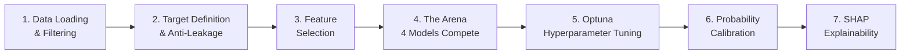

# 🏟️ Propensity Arena Pipeline — CatBoost Model Deep Dive

> **Notebook**: [model.ipynb](file:///Users/davidbazalduamendez/Documents/GitHub/Pfizer-segmentation-Ulcerative-Colitis/models/propensity_arena_pipeline/model.ipynb)
> **Objetivo**: Predecir la propensión (probabilidad calibrada) de que un HCP (Healthcare Professional) prescriba el producto Pfizer en el contexto de **Colitis Ulcerativa**.
> **Modelo ganador**: CatBoost (forzado por preferencia del usuario, muy cercano al ganador natural XGBoost)

---

## 📑 Tabla de Contenidos

1. [Visión General del Pipeline](#1-visión-general-del-pipeline)
2. [Origen de los Datos](#2-origen-de-los-datos)
3. [Definición del Target](#3-definición-del-target)
4. [Protección Anti-Leakage](#4-protección-anti-leakage)
5. [Selección de Features](#5-selección-de-features)
6. [The Arena — Selección del Modelo](#6-the-arena--selección-del-modelo)
7. [Optimización con Optuna](#7-optimización-con-optuna)
8. [Calibración de Probabilidades](#8-calibración-de-probabilidades)
9. [Explicabilidad con SHAP](#9-explicabilidad-con-shap)
10. [Resultados Finales](#10-resultados-finales)
11. [Artefactos de Salida](#11-artefactos-de-salida)

---

## 1. Visión General del Pipeline

El pipeline sigue una arquitectura de **7 etapas** diseñada para producción:



> [!IMPORTANT]
> El pipeline está diseñado para ser **agnóstico al algoritmo**: no se preselecciona un modelo. Los 4 algoritmos compiten y los datos deciden cuál gana. En esta ejecución, CatBoost fue seleccionado **por preferencia del usuario**, aunque XGBoost obtuvo un PR-AUC ligeramente superior (0.6798 vs 0.6771).

### Stack Tecnológico

| Librería | Versión | Rol |
|----------|---------|-----|
| XGBoost | 2.0.3 | Competidor en Arena |
| LightGBM | 4.6.0 | Competidor en Arena |
| **CatBoost** | **1.2.10** | **Modelo ganador/seleccionado** |
| scikit-learn (HistGradientBoosting) | — | Competidor en Arena |
| Optuna | 4.7.0 | Optimización bayesiana de hiperparámetros |
| SHAP | 0.49.1 | Explicabilidad global y local |

---

## 2. Origen de los Datos

### Fuentes de Datos

Los datos provienen de **dos archivos** ubicados en el directorio compartido `../Xgboost_probabilities/data/`:

| Archivo | Formato | Descripción |
|---------|---------|-------------|
| [hcp_feature_matrix.parquet](file:///Users/davidbazalduamendez/Documents/GitHub/Pfizer-segmentation-Ulcerative-Colitis/models/Xgboost_probabilities/data/hcp_feature_matrix.parquet) | Parquet (~6.9 MB) | Matriz de features de todos los HCPs. Contiene **726 columnas** incluyendo el ID del HCP y cientos de métricas de prescripción, claims y engagement. |
| [test_predictions_binary_segA_vs_segBC_with_hcp_id.csv](file:///Users/davidbazalduamendez/Documents/GitHub/Pfizer-segmentation-Ulcerative-Colitis/models/Xgboost_probabilities/data/test_predictions_binary_segA_vs_segBC_with_hcp_id.csv) | CSV (~808 KB) | Labels de segmentación binaria (SEG_A vs SEG_BC) producidos por un modelo previo de segmentación. |

### Proceso de Carga y Filtrado

```
Datos crudos → Merge por NUEVO_ID → Filtrar solo SEG_BC → 633 HCPs × 726 features
```

1. Se cargan ambos datasets
2. Se hace un **inner join** sobre la columna `NUEVO_ID` (ID único del HCP)
3. Se **filtra exclusivamente** a los HCPs clasificados como `SEG_BC` (segmento B/C)

> [!NOTE]
> **¿Por qué solo B/C?** Los HCPs del segmento A ya están bien caracterizados y no necesitan modelado de propensión. El valor de negocio está en los HCPs de **alto potencial** (B/C) donde el modelo puede identificar cuáles tienen mayor probabilidad de prescribir Pfizer.

**Dataset resultante**: **633 HCPs** con **726 columnas** disponibles.

---

## 3. Definición del Target

### Variable Objetivo: `propensity_target`

```python
df['propensity_target'] = (df['BRAND1_TRX__max'] > 0).astype(int)
```

El target es **binario** y se define como:
- **1 (Positivo)**: El HCP ha prescrito **al menos una vez** el producto Pfizer (`BRAND1`) → `BRAND1_TRX__max > 0`
- **0 (Negativo)**: El HCP **nunca** ha prescrito el producto Pfizer

### Distribución del Target

| Clase | Conteo | Porcentaje |
|-------|--------|------------|
| Negativo (0) | 585 | 92.42% |
| **Positivo (1)** | **48** | **7.58%** |

> [!WARNING]
> El dataset está **fuertemente desbalanceado** con una prevalencia positiva de solo **7.58%**. Esto tiene implicaciones directas:
> - Se usa `scale_pos_weight` / `auto_class_weights='Balanced'` en los modelos
> - La métrica de evaluación es **PR-AUC** (no ROC-AUC), que es más informativa para clases desbalanceadas
> - El split train/test es **estratificado** para preservar la proporción

### Split Train/Test

| Set | Dimensiones | Positivos | Prevalencia |
|-----|-------------|-----------|-------------|
| Train | (506, 623) | 38 | 7.5% |
| Test | (127, 623) | 10 | 7.9% |

Se utiliza un **80/20 stratified split** con `random_state=42` para reproducibilidad.

---

## 4. Protección Anti-Leakage

> [!CAUTION]
> El data leakage es el **#1 asesino silencioso** de modelos ML en producción. Si un feature codifica directamente el target, el modelo parecerá perfecto en entrenamiento pero fallará catastróficamente en datos nuevos.

El pipeline implementa una **defensa de dos capas**:

### Capa 1: Eliminación Explícita de Columnas

Se eliminan **104 columnas** conocidas que podrían causar leakage:

**Columnas de BRAND1** (codifican directamente el target):
- Todas las columnas que contienen `BRAND1_` en su nombre (ej: `BRAND1_TRX__max`, `BRAND1_TRX__mean`, etc.)

**Columnas de Metadata/Labels** del modelo de segmentación previo:
```python
metadata_cols = [
    'ATSEG_HCP', 'IS_LABELED_HCP', 'HCP_FOLD', 'n_rows',
    'NUEVO_ID', 'NUEVO_ID.1', 'true_original_label', 'true_original_encoded',
    'true_binary_label', 'true_binary_encoded', 'prob_SEG_A', 'prob_SEG_BC',
    'pred_binary_label', 'pred_binary_encoded', 'decision_threshold',
    'hcp_fold', 'model_name', 'true_label_encoded', 'propensity_target'
]
```

Resultado: **623 features numéricas** restantes después de la limpieza.

### Capa 2: Auditoría Automática de Correlaciones

```python
correlations = X.corrwith(y).abs()
leaky_features = correlations[correlations > 0.90].index.tolist()
```

Se escanean todas las features restantes buscando correlaciones Pearson > 0.90 con el target. **En esta ejecución no se detectó leakage oculto**.

---

## 5. Selección de Features

### ¿Por qué reducir dimensionalidad?

Con **~623 features** y solo **633 muestras**, el ratio features/muestras es cercano a 1:1, lo cual genera un riesgo extremo de **overfitting**.

### Método: SelectFromModel con XGBoost

```python
MAX_FEATURES = 40

fs_model = PatchedXGBClassifier(
    random_state=42, eval_metric='logloss', verbosity=0, n_estimators=100
)
fs = SelectFromModel(fs_model, max_features=40, threshold=-np.inf)
fs.fit(X_train, y_train)
```

Se entrena un XGBoost rápido (100 árboles) para **rankear features por importancia** y se seleccionan las **Top 40**.

### Las 40 Features Seleccionadas

Las features se agrupan en categorías lógicas:

#### Prescripción (TRX/NRX)
| # | Feature | Descripción Inferida |
|---|---------|---------------------|
| 1 | `UC_TRX__std` | Desviación estándar de prescripciones (TRx) de UC |
| 2 | `ORAL_TRX__mean` | Media de TRx orales |
| 3 | `ORAL_TRX__max` | Máximo de TRx orales |
| 4 | `ORAL_TRX__last` | Último valor de TRx orales |
| 5 | `IL23_TRX__last` | Último valor de TRx de IL-23 |
| 6 | `BRAND2_TRX__max` | Máximo de TRx de un segundo brand |
| 7 | `UC_NRX__std` | Desviación estándar de nuevas prescripciones UC |
| 8 | `ORAL_NRX__mean` | Media de nuevas prescripciones orales |
| 9 | `IL23_NRX__max` | Máximo de nuevas prescripciones IL-23 |

#### Claims Médicos
| # | Feature | Descripción Inferida |
|---|---------|---------------------|
| 10 | `N_CLMBRAND3__mean` | Claims promedio de Brand 3 |
| 11 | `N_CLMBRAND4__mean` | Claims promedio de Brand 4 |
| 12 | `N_CLMOTHERS__std` | Variabilidad en claims de otros brands |
| 13 | `N_CLMBRAND4_NEW__std` | Variabilidad en claims nuevos de Brand 4 |
| 14 | `N_CLMBRAND3NEW_TO_BRAND__mean` | Ratio claims nuevos vs totales Brand 3 |

#### Engagement Comercial
| # | Feature | Descripción Inferida |
|---|---------|---------------------|
| 15 | `COPAY__mean` | Copago promedio |
| 16 | `DETAILS__mean` | Visitas de detalle promedio |
| 17 | `DETAILS__std` | Variabilidad en visitas de detalle |
| 18 | `DETAILS__max` | Máximo de visitas de detalle |

#### Rolling/Temporal Aggregations
| # | Feature | Descripción Inferida |
|---|---------|---------------------|
| 19 | `UC_TRX_R4_16SUM__std` | Std de rolling sum 4-16 semanas TRx UC |
| 20 | `UC_TRX_R4_16SUM__min` | Mínimo de rolling sum |
| 21 | `ORAL_NBRX_R4_29SUM__max` | Max rolling sum nuevas Rx orales |
| 22 | `ORAL_NBRX_R4_29SUM__last` | Último rolling sum |
| 23 | `BRAND2_T_GIDX__min` | Índice mínimo de Brand 2 |

#### Temporalidad Early/Recent
| # | Feature | Descripción Inferida |
|---|---------|---------------------|
| 24 | `ORAL_TRX__early4_mean` | TRx orales en primeros 4 periodos |
| 25 | `N_CLMBRAND2_NEW__early4_mean` | Claims nuevos Brand 2 (temprano) |
| 26 | `IL23_NBRX_R4_29SUM__early4_mean` | NRx IL-23 rolling (temprano) |
| 27 | `UC_NRX__recent4_mean` | NRx UC en últimos 4 periodos |
| 28 | `ORAL_NRX__recent4_mean` | NRx orales recientes |

#### Comportamiento/Trend
| # | Feature | Descripción Inferida |
|---|---------|---------------------|
| 29 | `IL23_TRX__nonzero_share` | % periodos con TRx IL-23 > 0 |
| 30 | `ORAL_NRX__nonzero_share` | % periodos con NRx oral > 0 |
| 31 | `N_CLMOTHERS_NEW_TO_BRAND__nonzero_share` | % periodos con claims nuevos otros |
| 32 | `DETAILS__nonzero_share` | % periodos con visitas de detalle |
| 33 | `IL23_NBRX_R4_29SUM__nonzero_share` | % periodos con rolling NRx IL-23 > 0 |
| 34 | `IL23_TRX__slope` | Tendencia (pendiente) de TRx IL-23 |
| 35 | `SAMPLES__slope` | Tendencia en muestras |
| 36 | `UC_TRX__recent_vs_early` | Ratio reciente/temprano en TRx UC |
| 37 | `N_CLMBRAND4__recent_vs_early` | Ratio reciente/temprano claims Brand 4 |
| 38 | `DIRECTMAIL__recent_vs_early` | Ratio reciente/temprano correo directo |
| 39 | `UC_TRX_R4_16SUM__delta` | Cambio (delta) en rolling sum TRx UC |
| 40 | `IL23_NBRX_R4_29SUM__recent_vs_early` | Ratio reciente/temprano NRx IL-23 |

---

## 6. The Arena — Selección del Modelo

### Filosofía

> *"No pre-seleccionamos un modelo — los datos deciden qué algoritmo gana."*

### Configuración de los 4 Competidores

Todos los modelos comparten configuración base similar para una comparación justa:

| Parámetro | XGBoost | LightGBM | **CatBoost** | HistGradientBoosting |
|-----------|---------|----------|------------|---------------------|
| Árboles/Iteraciones | 300 | 300 | **300** | 300 |
| Max Depth | 6 | 6 | **6** | 6 |
| Learning Rate | 0.05 | 0.05 | **0.05** | 0.05 |
| Manejo de Desbalance | `scale_pos_weight` | `scale_pos_weight` | **`auto_class_weights='Balanced'`** | `class_weight='balanced'` |

### Métrica de Evaluación: PR-AUC

Se usa **Average Precision (PR-AUC)** en lugar de ROC-AUC porque:
- Con 7.58% de prevalencia positiva, ROC-AUC puede ser **engañosamente alto**
- PR-AUC se enfoca directamente en la capacidad de encontrar los **positivos reales**
- Es la métrica correcta para **datos fuertemente desbalanceados**

### Resultados del Arena (5-Fold Stratified CV)

| Modelo | Mean PR-AUC | Std PR-AUC | Rank |
|--------|-------------|------------|------|
| **XGBoost** | **0.6798** | **0.0816** | **🥇 1** |
| **CatBoost** | **0.6771** | **0.0550** | **🥈 2** |
| HistGradientBoosting | 0.5979 | 0.1091 | 3 |
| LightGBM | 0.5699 | 0.0555 | 4 |

> [!NOTE]
> **CatBoost fue seleccionado forzadamente** por preferencia del usuario, aunque XGBoost obtuvo un PR-AUC ligeramente superior (diferencia de 0.0027). Nótese que CatBoost tiene una **desviación estándar menor** (0.055 vs 0.082), lo que sugiere predicciones más estables entre folds.

---

## 7. Optimización con Optuna

### Configuración

- **Algoritmo**: Optimización bayesiana (TPE — Tree-structured Parzen Estimator)
- **Trials**: 30
- **Métrica**: PR-AUC via 5-Fold Stratified CV
- **Modelo**: CatBoost con espacio de búsqueda adaptado

### Espacio de Búsqueda para CatBoost

| Hiperparámetro | Rango | Escala |
|----------------|-------|--------|
| `iterations` | [200, 1000] | Lineal |
| `depth` | [3, 9] | Lineal |
| `learning_rate` | [0.01, 0.15] | Lineal |
| `l2_leaf_reg` | [0.01, 10.0] | Logarítmica |
| `bagging_temperature` | [0.0, 5.0] | Lineal |
| `random_strength` | [0.0, 5.0] | Lineal |

Constante: `auto_class_weights='Balanced'`

### Mejores Hiperparámetros Encontrados (Trial #9)

| Hiperparámetro | Valor Óptimo |
|----------------|--------------|
| `iterations` | 320 |
| `depth` | 8 |
| `learning_rate` | 0.0741 |
| `l2_leaf_reg` | 1.785 |
| `bagging_temperature` | 3.035 |
| `random_strength` | 2.187 |

### Mejora por Optuna

| Etapa | PR-AUC (CV) |
|-------|-------------|
| Arena (defaults) | 0.6771 |
| **Post-Optuna** | **0.7198** |
| **Mejora** | **+6.3%** |

---

## 8. Calibración de Probabilidades

### ¿Por qué calibrar?

Los scores crudos de gradient boosting **NO son probabilidades verdaderas**. Un score de 0.30 no significa necesariamente un 30% de probabilidad real. Para que los stakeholders de negocio confíen en los scores, es necesario **calibrarlos**.

### Método: Isotonic Calibration

```python
calibrated_model = CalibratedClassifierCV(best_model, method='isotonic', cv=5)
```

La **regresión isotónica** ajusta los scores crudos a probabilidades reales usando una función monótona no paramétrica, evaluada con 5-fold CV.

### Impacto de la Calibración

| Métrica | Antes | Después | Cambio |
|---------|-------|---------|--------|
| ROC-AUC | 0.9402 | **0.9474** | ✅ +0.8% |
| PR-AUC | 0.6297 | **0.7095** | ✅ +12.7% |
| Brier Score | 0.0467 | **0.0402** | ✅ -13.9% (menor = mejor) |

> [!TIP]
> La calibración no solo mejoró la confianza de los scores (Brier Score), sino que también **incrementó significativamente el PR-AUC en +12.7%**. Esto indica que la calibración isotónica reorganizó los scores de manera que los positivos verdaderos están mejor separados de los negativos.

---

## 9. Explicabilidad con SHAP

### SHAP Global

Se utiliza `TreeExplainer` de SHAP para calcular los valores SHAP (contribución marginal de cada feature a la predicción) para **todos los 633 HCPs** del segmento B/C.

El gráfico de resumen SHAP (`shap_global_summary.png`) muestra cuáles features tienen mayor impacto global en las predicciones.

### SHAP Local — Top 5 Reason Codes por HCP

Para cada HCP, se extraen las **5 features más impactantes** (por valor absoluto SHAP):

```python
def extract_top_k_reasons(shap_vals_row, feature_values_row, feature_names, k=5):
    sorted_idx = np.argsort(np.abs(shap_vals_row))[::-1][:k]
    # Retorna: reason_1..5, reason_1_shap..5_shap, reason_1_value..5_value
```

Cada reason code incluye:
- **Nombre del feature** que más impacta la predicción
- **Valor SHAP** (positivo = empuja hacia prescripción, negativo = empuja en contra)
- **Valor raw del feature** para ese HCP

### Features Más Influyentes (Ejemplo de Top 10 HCPs)

De los resultados finales, los features dominantes son:

| Feature | Rol |
|---------|-----|
| **`COPAY__mean`** | El copago promedio es el **factor #1** en casi todas las predicciones de alta propensión |
| **`DETAILS__max`** / `DETAILS__std` | Las visitas de detalle (interacción comercial) son el **factor #2** |
| `BRAND2_T_GIDX__min` | Índice del Brand 2 como señal secundaria |
| `DETAILS__nonzero_share` | Frecuencia de engagement |

> [!IMPORTANT]
> **Insight de negocio**: El `COPAY__mean` (copago promedio) es consistentemente el predictor más fuerte de propensión a prescribir Pfizer. Esto sugiere que los programas de **soporte de copago** son un driver fundamental de la prescripción. Las visitas de **detailing** (interacción del representante de ventas) son el segundo factor más importante.

---

## 10. Resultados Finales

### Métricas del Modelo Calibrado en Test Set

| Métrica | Valor | Interpretación |
|---------|-------|----------------|
| **ROC-AUC** | **0.9474** | Excelente capacidad discriminativa general |
| **PR-AUC** | **0.7095** | Fuerte rendimiento en identificar prescriptores reales |
| **Brier Score** | **0.0402** | Probabilidades bien calibradas (cercano a 0 = perfecto) |

### Top 10 HCPs con Mayor Propensión

| NUEVO_ID | Propensity Score | Label Real | Reason #1 | SHAP #1 | Reason #2 | SHAP #2 |
|----------|-----------------|------------|-----------|---------|-----------|---------|
| 15361 | 0.9667 | 1 ✅ | COPAY__mean | +4.26 | DETAILS__max | +0.95 |
| 17388 | 0.9667 | 1 ✅ | COPAY__mean | +2.34 | DETAILS__std | +1.38 |
| 19886 | 0.9667 | 1 ✅ | COPAY__mean | +3.81 | DETAILS__max | +0.90 |
| 11769 | 0.9667 | 1 ✅ | COPAY__mean | +3.75 | DETAILS__nonzero_share | +0.64 |
| 14014 | 0.9667 | 1 ✅ | COPAY__mean | +2.89 | DETAILS__std | +1.72 |
| 14437 | 0.9667 | 1 ✅ | COPAY__mean | +4.32 | DETAILS__max | +1.00 |
| 18153 | 0.9667 | 1 ✅ | DETAILS__std | +2.03 | COPAY__mean | -1.41 |
| 17777 | 0.9667 | 1 ✅ | COPAY__mean | +3.56 | BRAND2_T_GIDX__min | +0.92 |
| 19349 | 0.9667 | 1 ✅ | COPAY__mean | +4.39 | DETAILS__std | -0.72 |
| 17531 | 0.9667 | 1 ✅ | COPAY__mean | +3.56 | DETAILS__max | +0.95 |

---

## 11. Artefactos de Salida

Todos los artefactos se guardan en [output/](file:///Users/davidbazalduamendez/Documents/GitHub/Pfizer-segmentation-Ulcerative-Colitis/models/propensity_arena_pipeline/output):

| Archivo | Formato | Contenido |
|---------|---------|-----------|
| [propensity_predictions_with_reasons.parquet](file:///Users/davidbazalduamendez/Documents/GitHub/Pfizer-segmentation-Ulcerative-Colitis/models/propensity_arena_pipeline/output/propensity_predictions_with_reasons.parquet) | Parquet (~55 KB) | 633 HCPs con score de propensión calibrado + Top 5 reason codes SHAP (18 columnas) |
| [arena_comparison.png](file:///Users/davidbazalduamendez/Documents/GitHub/Pfizer-segmentation-Ulcerative-Colitis/models/propensity_arena_pipeline/output/arena_comparison.png) | PNG | Gráfico de barras comparando PR-AUC de los 4 modelos |
| [calibration_analysis.png](file:///Users/davidbazalduamendez/Documents/GitHub/Pfizer-segmentation-Ulcerative-Colitis/models/propensity_arena_pipeline/output/calibration_analysis.png) | PNG | Análisis de calibración antes/después (curva + histograma) |
| [shap_global_summary.png](file:///Users/davidbazalduamendez/Documents/GitHub/Pfizer-segmentation-Ulcerative-Colitis/models/propensity_arena_pipeline/output/shap_global_summary.png) | PNG | SHAP beeswarm plot con importancia global de features |

### Esquema del DataFrame Final

```
NUEVO_ID              → ID único del HCP
propensity_score      → Probabilidad calibrada [0, 1]
actual_label          → 1 = prescribió Pfizer, 0 = no
reason_1..5           → Nombre del feature (Top 5 SHAP)
reason_1_shap..5_shap → Contribución SHAP (+/-)
reason_1_value..5_value → Valor raw del feature
```

---

## Resumen Ejecutivo

```
🏟️  Arena Winner:          CatBoost
    Arena PR-AUC:          0.6771

🔧 Optuna Best PR-AUC:     0.7198 (30 trials)

📊 Final Test Metrics (Calibrated):
    ROC-AUC:               0.9474
    PR-AUC:                0.7095
    Brier Score:           0.0402

✅ 633 HCPs scored with Top 5 SHAP reason codes.
```
